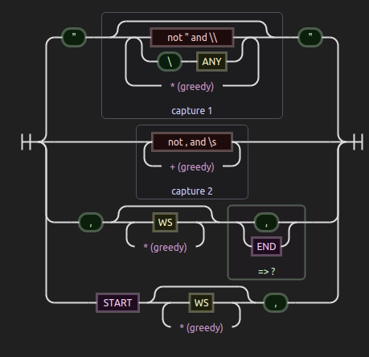

# Práctica 2: Comma separated values (CSV) usando MongoDB

###[Descripción de la práctica](https://casianorodriguezleon.gitbooks.io/pl1516/content/practicas/practicamongodb.html)
* See also [CSV](http://en.wikipedia.org/wiki/Comma-separated_values) at Wikipedia.

**Repositorios GitHub**
* [Repositorio de la Organización](https://github.com/ULL-ESIT-GRADOII-PL/mongodb-mongoose-csv-ga.git)
* [Repositorio de trabajo](https://github.com/marreA/mongodb-mongoose-csv-ga.git)

###[Despliegue](https://procesadores-marrero.c9users.io)

* [Enlace de la aplicación en Cloud9](https://ide.c9.io/marrero_/procesadores/mongodb-mongoose-csv-ga)

**Página del autor**

* [Alejandro Marrero](https://marreA.github.io/)

## RegExp
Autómata que representa la expresión regular utilizada para analizar la entrada en formato CSV.

### 